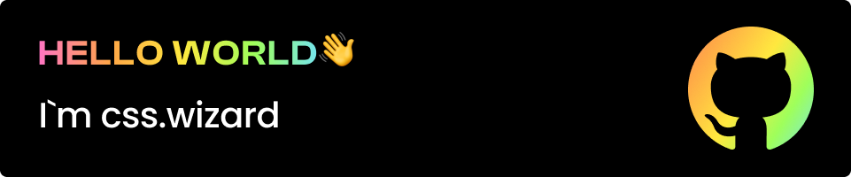

<h1>Hi 👋</h1>
<h3>I post daily content on my Instagram page css.wizard. For more than three years, I have had many opportunities to work in a wide range of web technologies, which has allowed me to accumulate a significant amount of diverse experience.</h3>
<h3 align="left">Connect with me:</h3>

<h3 align="left">Languages and Tools:</h3>

   </a>        

<!--

 

&nbsp;
--->
